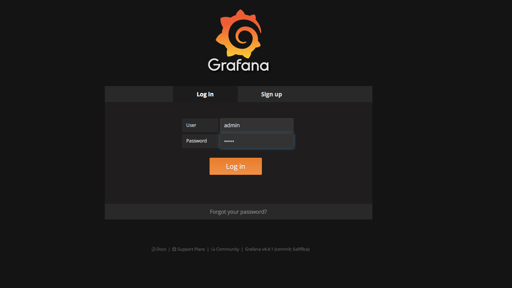
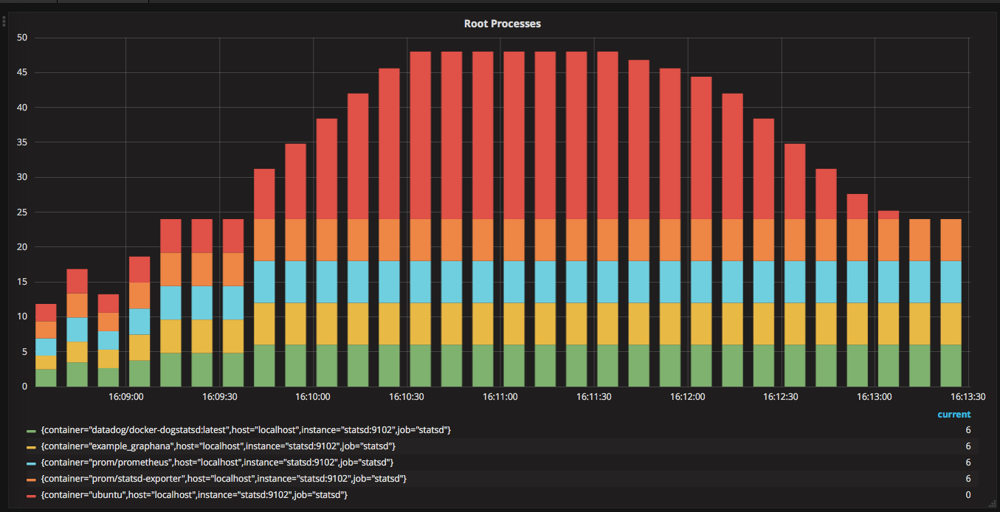

# cnitch

 [](https://circleci.com/gh/nicholasjackson/cnitch)  
 [](https://godoc.org/github.com/nicholasjackson/cnitch)  
 [](https://quay.io/repository/nicholasjackson/cnitch)

cnitch (snitch or container snitch) is a simple framework and command line tool for monitoring Docker containers to identify any processes which are running as root.  

Why is this a bad thing?  If you have not already been to [can I haz non-privileged containers? by mhausenblas](http://canihaznonprivilegedcontainers.info) then I recommend you head over there now to get all the info.


## How it works
cnitch connects to the Docker Engine using the API and queries the currently running containers,  it then inspects the processes running inside this container and identifies any which are running as the root user.  
When a root process is found this information is sent to the configurable reporting modules allowing you to audit or take action on this information.

```bash
2017/07/29 16:04:27 Starting Cnitch: Monitoring Docker Processes at: tcp://172.16.255.128:2376
2017/07/29 16:04:27 Checking for root processes every: 10s
2017/07/29 16:05:08 Checking image: ubuntu, id: 7bd489560a310343c39186500daa680290289c27f7a730524a31355a3aaf0430
2017/07/29 16:05:08 >> WARNING: found process running as root: tail -f /dev/null pid: 365
```

## Reporting Modules
At present cnitch has the capability of reporting to **StatsD** and **StdOut**.  Reporting backends are extensible to make it easy to support any backend, for example it would be a fairly trivial process to build a backend to support log stash or another log file aggregation tool.

### StatsD
The exceptions are sent to the statsD endpoint as a count using the `cnitch.exception.root_process` metric.  The metrics are also tagged with the `host` name of the cnitch instance and the `container` name.

### StdOut
The StdOut logger is a simple output logger which sends the reported exceptions to StdOut. 

## How to run
Wether you run cnitch in a Docker container or if you run it as a binary it needs access to the Docker api by setting the URL of the server or the path to the socket with the environment variable **DOCKER_HOST**

### Flags
* `--hostname=[hostname]` the name or ip address to be used for metric aggregation
* `--statsd-server=[hostname:port]` the URI of the statsd collector, if omitted statsd reporting will be disabled
* `--check=[duration  e.g. 10s (10 seconds), 1m (1 minute)]` , the check frequency that snitch will scan for root processes

### Command Line
Set environment variable **DOCKER_HOST** to your docker engine API then run snitch with the required flags.

```bash
$ cnitch --hostname=myhost --statsd-server=127.0.0.1:8125 --check=10s
```

### Docker
cnitch runs in a non privileged container and if you wish to use the Docker sock for access to the API you need to add the cnitch user to the `docker` group.   This can be achieved through the flag `--group-add` , set this to the group id for the docker user group.  
 For example:

 `--group-add=$(stat -f "%g" /var/run/docker.sock`

*Example using the Docker sock file for API access*

```bash
$ docker run -i -t --rm \
  -v /var/run/docker.sock:/var/run/docker.sock \
  --group-add=$(stat -f "%g" /var/run/docker.sock) \
  -e "DOCKER_HOST:unix:///var/run/docker.sock" \
  quay.io/nicholasjackson/cnitch [options]
```

If you are running on a mac and using Docker Machine the Docker sock is inside the VM which means you can not use the `stat` command to discover the group id.

## Example
There is an example Docker Compose stack inside the [./example](/example) folder to show how cnitch exports data to statsd.  To run this example start the example run:

```
$ cd ./example
$ docker-compose up
``` 

Once everything has started running open `http://[docker host ip]:3000` in your web browser and you should see the Grafana login screen.



Log in to Grafana using the following credentials:
* user: admin
* password: admin

Then select the cnitch dashboard.  This dashboard shows the current running root processes.  



If you are not using `/var/run/docker.sock` to communicate with your Docker host then you will need to change some of the settings inside the file `./example/docker-compose.yml` to match your settings.

## Roadmap
Implement features from Docker Bench Security Script [https://github.com/docker/docker-bench-security](https://github.com/docker/docker-bench-security)

[ ] 1.1 Ensure a separate partition for containers has been created
[ ] 1.2 Ensure the container host has been Hardened
[ ] 1.3 Ensure Docker is up to date
[ ] 1.4 Ensure only trusted users are allowed to control Docker daemon
[ ] 1.5 Ensure auditing is configured for the Docker daemon 
[ ] 1.6 Ensure auditing is configured for Docker files and directories - /var/lib/docker
[ ] 1.7 Ensure auditing is configured for Docker files and directories - /etc/docker
[ ] 1.8 Ensure auditing is configured for Docker files and directories - docker.service
[ ] 1.9 Ensure auditing is configured for Docker files and directories - docker.socket
[ ] 1.10 Ensure auditing is configured for Docker files and directories - /etc/default/docker
[ ] 1.11 Ensure auditing is configured for Docker files and directories - /etc/docker/daemon.json
[ ] 1.12 Ensure auditing is configured for Docker files and directories - /usr/bin/docker-containerd
[ ] 1.13 Ensure auditing is configured for Docker files and directories - /usr/bin/docker-runc

[ ] 2.1 Ensure network traffic is restricted between containers on the default bridge
[ ] 2.2 Ensure the logging level is set to 'info
[ ] 2.3 Ensure Docker is allowed to make changes to iptables
[ ] 2.4 Ensure insecure registries are not used
[ ] 2.5 Ensure aufs storage driver is not used
[ ] 2.6 Ensure TLS authentication for Docker daemon is configured
[ ] 2.7 Ensure the default ulimit is configured appropriately
[ ] 2.8 Enable user namespace support
[ ] 2.9 Ensure the default cgroup usage has been confirmed
[ ] 2.10 Ensure base device size is not changed until needed
[ ] 2.11 Ensure that authorization for Docker client commands is enabled
[ ] 2.12 Ensure centralized and remote logging is configured
[ ] 2.13 Ensure operations on legacy registry (v1) are Disabled
[ ] 2.14 Ensure live restore is Enabled
[ ] 2.15 Ensure Userland Proxy is Disabled
[ ] 2.16 Ensure daemon-wide custom seccomp profile is applied, if needed
[ ] 2.17 Ensure experimental features are avoided in production
[ ] 2.18 Ensure containers are restricted from acquiring new privileges

[ ] 3.x ...

[x] 4.1 Ensure a user for the container has been created
[ ] 4.2 Ensure that containers use trusted base images
[ ] 4.3 Ensure unnecessary packages are not installed in the container
[ ] 4.4 Ensure images are scanned and rebuilt to include security patches
[ ] 4.5 Ensure Content trust for Docker is Enabled
[ ] 4.6 Ensure HEALTHCHECK instructions have been added to the container image
[ ] 4.7 Ensure update instructions are not use alone in the Dockerfile
[ ] 4.8 Ensure setuid and setgid permissions are removed in the images
[ ] 4.9 Ensure COPY is used instead of ADD in Dockerfile
[ ] 4.10 Ensure secrets are not stored in Dockerfiles
[ ] 4.11 Ensure verified packages are only Installed

[ ] 5.x ...

[ ] 6.x ...

[ ] 7.x ...
